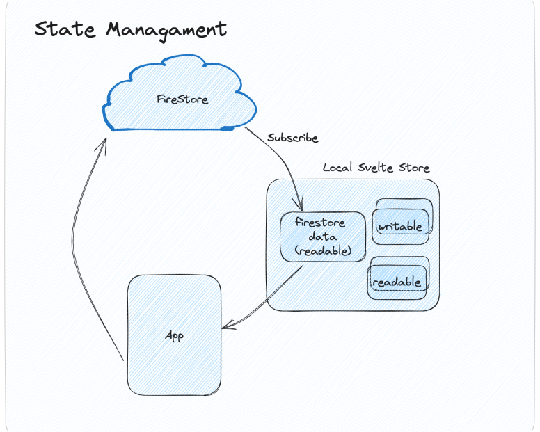
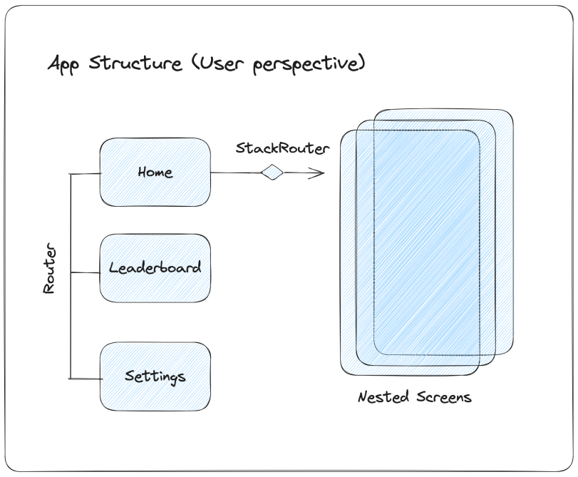
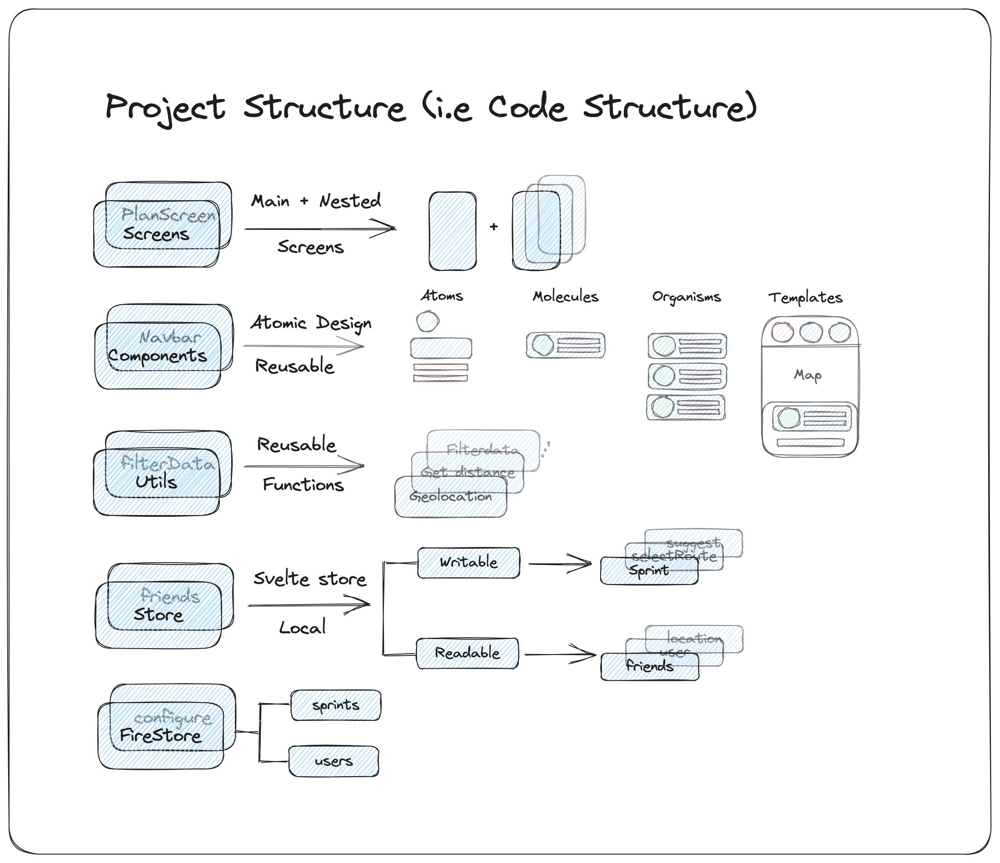

# Sprint 

| Name  |  Student Id | Email  
|----|----|----|
| Nurlykhan  | 20190779  | knurlykhan@kaist.ac.kr  |
| SnowSuno  |  20220042 | snowsuno@kaist.ac.kr  |  
| Ihchae |  20200216 |   ihchaeryu@kaist.ac.kr|  

| [Github Link](https://github.com/SnowSuno/ID311-run-and-share)  |  [Youtube Link](https://youtu.be/62ArnzPujnA)
|---|---|
 

##  Description
**Sprint** is a mobile application for jogging community, which introduces newest interactions to *connect, plan and sprint daily*.
With a help of live tracking, people can track their daily sprint, and get accurate sprint summary. Moreover, it has a simple user interface to search for a suitable path recommended by other community members.
Furthermore, people can check their friends' daily sprint to follow their path, or "poke" their friends to run daily, if any of the friends forgot about their daily sprint! 

##  Code Organization
### State Management
Firestore being our main storage, we also use Svelte's local storage to keep track of different states. It has overall **MVC** pattern, but it also uses **Observer** pattern, where subscribers gets notified whenever the state of subject changes!

### App Structure
From users' perspective, user get see Main Pages, which are Home, LeaderBoard and Settings. These are displayed using simple svelte's spa router. Whereas, Nestes Screens such as Plan.Svelte has own original routing system StackRouter, which has been implemented by our team. In simple terms, StackRouter stacks each screen, and displays it. So either you can add screen, or pop screen!

### Project Structure
As mentioned before, we have screens folder, which is responsible for Screen Display Elements. We tried our best to use Atomic Design for our components, where small atoms such as user icon, joins other atoms to create molecules such as Form and so on. Moreover, we have utils folder, where we store reusable functions needed for filtering data, or calculating distance and more. Lastly, as mentioned before we use Svelte store for local state handling with svelte's writable and readables, while Firestore as a main database, where we have two collections: sprints and users!

## Known Issues
* In small distances, Geolocation api is not accurate. So, path drawing gets loses accuracy too.

